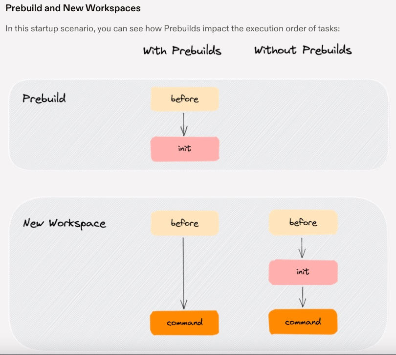
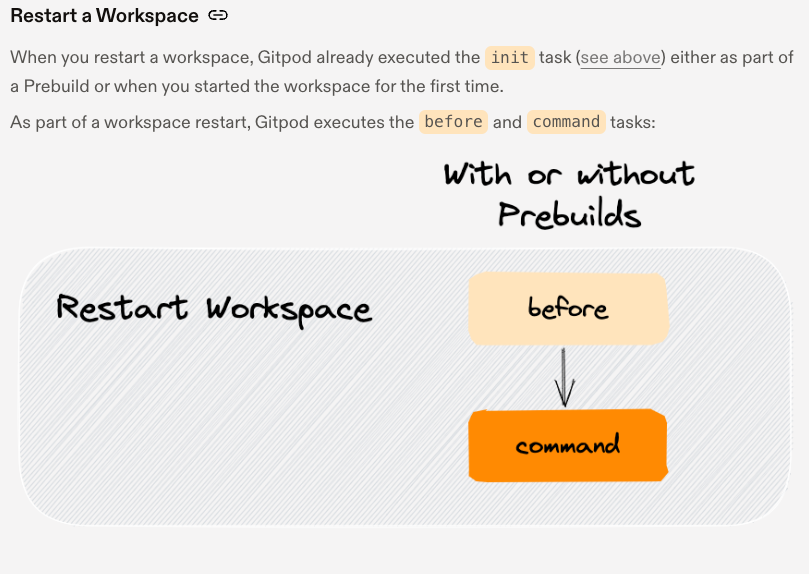
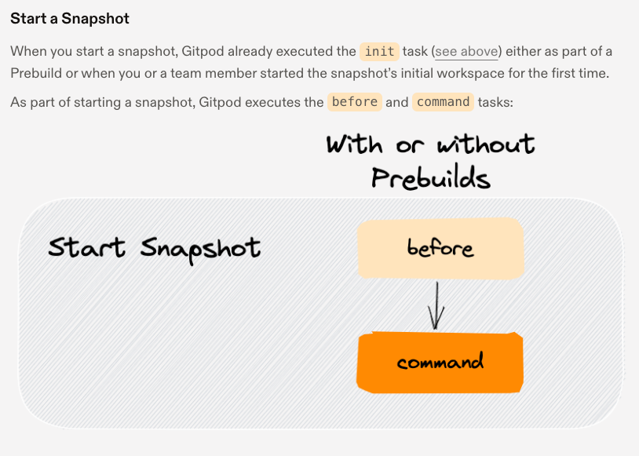

# Terraform Beginner Bootcamp 2023 - Week0


- [Semantic Versioning](./Week0.md#semantic-versioning-mage)
- [Install the Terraform CLI](./Week0.md#install-the-terraform-cli)
  * [Considerations with the Terraform CLI changes](./Week0.md#considerations-with-the-terraform-cli-changes)
  * [Considerations for Linux Distribution](./Week0.md#considerations-for-linux-distribution)
  * [Refactoring into Bash Scripts](./Week0.md#refactoring-into-bash-scripts)
    + [Shebang Considerations](./Week0.md#shebang-considerations)
    + [Execution Considerations](./Week0.md#execution-considerations)
    + [Linux Permissions Considerations](./Week0.md#linux-permissions-considerations)
- [Gitpod Lifecycle](./Week0.md#gitpod-lifecycle)
- [Working with Env Vars](./Week0.md#working-with-env-vars)
  * [env Command](./Week0.md#env-command)
  * [Setting and Unsetting Env Vars](./Week0.md#setting-and-unsetting-env-vars)
  * [Printing Vars](./Week0.md#printing-vars)
  * [Scoping of Env Vars](./Week0.md#scoping-of-env-vars)
  * [Persisting Env Vars in Gitpod](./Week0.md#persisting-env-vars-in-gitpod)
- [AWS CLI Installation](./Week0.md#aws-cli-installation)
- [Terrform Basics](./Week0.md#terraform-basics)
  * [Terraform Registry](./Week0.md#terraform-registry)
  * [Terraform Console](./Week0.md#terraform-console)
    + [Terraform init](./Week0.md#terraform-init)
    + [Terraform Plan](./Week0.md#terraform-plan)
    + [Terraform Apply](./Week0.md#terraform-apply)
    + [Terraform Destroy](./Week0.md#terraform-destroy)
  * [Terraform Lock Files](./Week0.md#terraform-lock-files)
  * [Terraform State Files](./Week0.md#terraform-state-files)
  * [Terraform Directory](./Week0.md#terraform-directory)


## Semantic Versioning :mage:

We are going to use semantic versioning for tagging in this project

[Semver.org](https://semver.org/)

The format will be as below:

**MAJOR.MINOR.PATCH** e.g. `1.0.0`

Given a version number **MAJOR.MINOR.PATCH**, increment the:

**MAJOR** version when you make incompatible API changes
**MINOR** version when you add functionality in a backward-compatible manner
**PATCH** version when you make backward-compatible bug fixes
Additional labels for pre-release and build metadata are available as extensions to the MAJOR.MINOR.PATCH format.

## Install the Terraform CLI

### Considerations with the Terraform CLI changes

The Terraform CLI installation instructions have been changed due to gpg keyring changes. So we need to refer to the latest install CLI instructions via Terraform Documentation below:

[Install Terraform CLI](https://developer.hashicorp.com/terraform/tutorials/aws-get-started/install-cli)


### Considerations for Linux Distribution

We have to check our Linux Distribution to consider this while building our scripts and changes as some considerations may be needed for different distributions.

This project is built against Ubuntu.

[How To Check OS Version in Linux](
https://www.cyberciti.biz/faq/how-to-check-os-version-in-linux-command-line/)

Example of checking OS Version:

```
$ cat /etc/os-release

PRETTY_NAME="Ubuntu 22.04.3 LTS"
NAME="Ubuntu"
VERSION_ID="22.04"
VERSION="22.04.3 LTS (Jammy Jellyfish)"
VERSION_CODENAME=jammy
ID=ubuntu
ID_LIKE=debian
HOME_URL="https://www.ubuntu.com/"
SUPPORT_URL="https://help.ubuntu.com/"
BUG_REPORT_URL="https://bugs.launchpad.net/ubuntu/"
PRIVACY_POLICY_URL="https://www.ubuntu.com/legal/terms-and-policies/privacy-policy"
UBUNTU_CODENAME=jammy
```

### Refactoring into Bash Scripts

We decided to create a bash script to install the Terraform CLI to keep ([.gitpod.yml](.gitpod.yml)) file cleaned and tidy and will be better for portability to have one script to install Terraform CLI.

This bash script is located here: [./bin/install_terraform_cli](./bin/install_terraform_cli)

#### Shebang Considerations

A Shebang (pronounced Sha-bang) tells the bash script what program will interpret the script. eg. `#!/bin/bash`

ChatGPT and below WiKi URL recommend this format for bash and others like python: 

`#!/usr/bin/env bash`
`#!/usr/bin/env python3`

- for portability for different OS distributions. 
-  will search the user's PATH for the executable like bash/python3 mentioned in the previous example.

[Shebang WiKi](https://en.wikipedia.org/wiki/Shebang_(Unix))

#### Execution Considerations

When executing the bash script we can use the `./` shorthand notation to execute the bash script.

eg. `./bin/install_terraform_cli`

If we are using a script in ([.gitpod.yml](.gitpod.yml)) we need to point the script to a program to interpret it.

eg. `source ./bin/install_terraform_cli`

#### Linux Permissions Considerations

In order to make our bash scripts executable we need to change linux permission for the fix to be executable at the user mode.

```sh
chmod u+x ./bin/install_terraform_cli
```

alternatively:

```sh
chmod 744 ./bin/install_terraform_cli
```

[chmod WiKi](https://en.wikipedia.org/wiki/Chmod)

## Gitpod Lifecycle

Below you can find life cycle for New WorkSpace, Restart WorkSpace and Start Snapshot:


[GitPod Docs ](https://www.gitpod.io/docs/configure/workspaces/tasks)

[gitpodify](https://www.gitpod.io/guides/gitpodify)








## Working with Env Vars

### env command

We can list out all Enviroment Variables (Env Vars) using the `env` command

We can filter specific env vars using grep eg. `env | grep AWS_`

### Setting and Unsetting Env Vars

In the terminal, we can set vars using `export HELLO='world`

In the terminal, we can unset vars using `unset HELLO`

We can set an env var temporarily when just running a command like below:

```sh
HELLO='world' ./bin/print_message
```

Within a bash script, we can set env without writing export eg.

```sh
#!/usr/bin/env bash

HELLO='world'

echo $HELLO
```

### Printing Vars

We can print an env var using echo eg. `echo $HELLO`

### Scoping of Env Vars

When you open up new bash terminals in VSCode it will not be aware of env vars that you have set in another window.

If you want to Env Vars to persist across all future bash terminals that are open you need to set env vars in your bash profile. eg. `.bash_profile`

### Persisting Env Vars in Gitpod

[Gitpod Env Vars](https://www.gitpod.io/docs/configure/projects/environment-variables)

We can persist env vars into gitpod by storing them in Gitpod Secrets Storage.

```
Usage:
  gp env [flags]

Flags:
  -e, --export   produce a script that can be eval'ed in Bash
  -h, --help     help for env
  -u, --unset    deletes/unsets persisted environment variables
```
e.g:
```
gp env HELLO='world'
```

All future workspaces launched will set the env vars for all bash terminals opened in those workspaces. If you want to set that environment variable in your terminal, you can do so using -e:

```bash
eval $(gp env -e foo=bar)
```

To update the current terminal session with the latest set of persistent environment variables, use:

`eval $(gp env -e)`

You can also set en vars in the `.gitpod.yml` but this can only contain non-senstive env vars.

## AWS CLI Installation

AWS CLI is installed for the project via the bash script [`./bin/install_aws_cli`](./bin/install_aws_cli)


[Getting Started Install (AWS CLI)](https://docs.aws.amazon.com/cli/latest/userguide/getting-started-install.html)

[AWS CLI Env Vars](https://docs.aws.amazon.com/cli/latest/userguide/cli-configure-envvars.html)

We'll need to generate AWS CLI credits from IAM User in order to the user AWS CLI.

We can check if our AWS credentials are configured correctly by running the following AWS CLI command:

```sh
aws sts get-caller-identity
```

If it is successful you should see a JSON payload return that looks like this:

```json
{
    "UserId": "AIDAZYYPQ4SVYAZ6HYLMS",
    "Account": "671658075307",
    "Arn": "arn:aws:iam::671658075307:user/TFBeginnerUsr"
}
```
I am using TFBeginnerUsr user for this project.

## Terraform Basics

### Terraform Registry

Terraform sources their providers and modules from the Terraform registry which is located at [registry.terraform.io](https://registry.terraform.io/)

- **Providers** is an interface to APIs that allows resource creation in Terraform.
- **Modules** are a way to make large amounts of terraform code modular, portable and sharable.

[Random Terraform Provider](https://registry.terraform.io/providers/hashicorp/random)

### Terraform Console

We can see a list of all the Terraform commands by simply typing `terraform`


#### Terraform init

`terraform init`

At the start of a new terraform project, we will run `terraform init` to download the binaries for the terraform providers that we'll use in the project.

#### Terraform Plan

`terraform plan`

This will generate out a changeset, about the state of our infrastructure and what will be changed.

We can output this changeset ie. "plan" to be passed to an apply command, but often you can just ignore outputting.

#### Terraform Apply

`terraform apply`

This will run a plan and pass the changeset to be executed by Terraform. Apply should prompt yes or no.

If we want to automatically approve an apply command we can provide the auto approve flag eg. `terraform apply --auto-approve`

#### Terraform Destroy

`teraform destroy`

This will destroy resources.

You can also use the auto approve flag to skip the approve prompt eg. `terraform apply --auto-approve`

### Terraform Lock Files

`.terraform.lock.hcl` contains the locked versioning for the providers or modules that should be used in the project.

The Terraform Lock File **should be committed** to your Version Control System (VSC) eg. Github

### Terraform State Files

`.terraform.tfstate` contains information about the current state of your infrastructure.

This file **should not be committed** to your VCS.

This file can contain sensitive data.

If you lose this file, you lose knowing the state of your infrastructure.

`.terraform.tfstate.backup` is the previous state file state.

### Terraform Directory

`.terraform` directory contains binaries of terraform providers.
